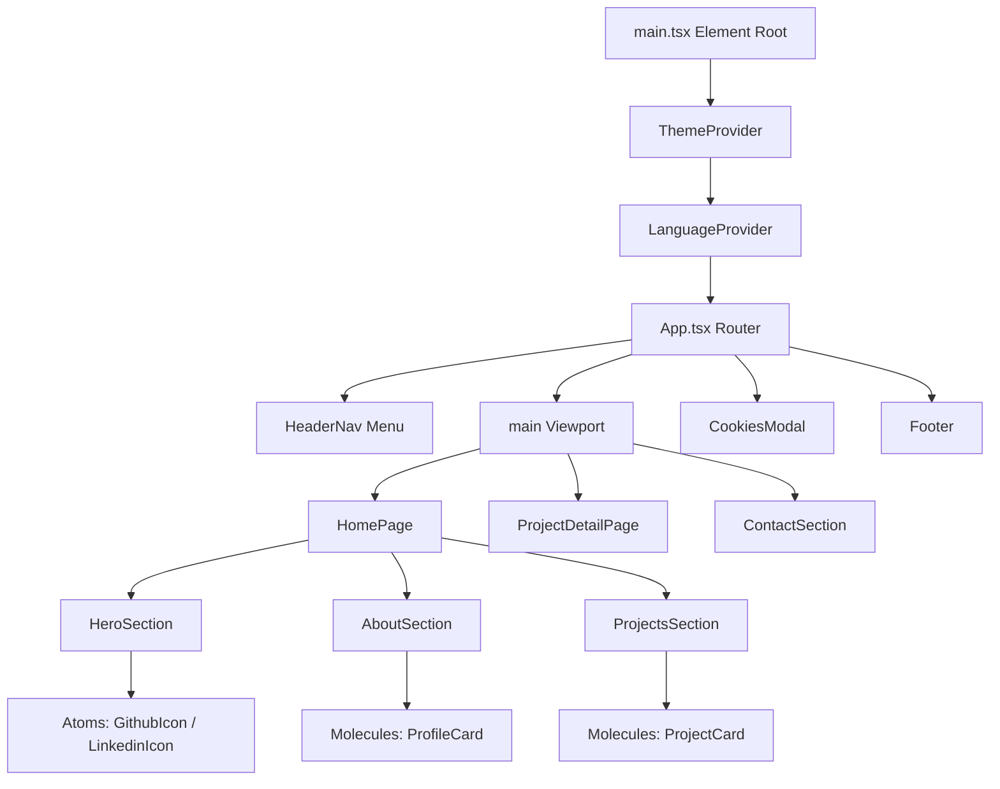

# Portfólio: Stack Tecnológica, Arquitetura e Funcionalidades

Este documento apresenta o detalhamento da arquitetura do projeto de portfólio pessoal, com foco na nova estrutura moderna e limpa, baseada em React (v19), TypeScript e **Atomic Design**, descrevendo suas integrações, estrutura e comandos de execução.

---

## 📚 Bibliotecas Utilizadas e sua Importância

### 1. **React (v19) & React-DOM**
- **Utilidade**: A base de toda a arquitetura de componentes do aplicativo. Permite a criação estruturada de estados reativos (como a alternância de temas e idiomas) com excelente ciclo de vida e renderização otimizada.

### 2. **TypeScript (v7)**
- **Utilidade**: Tipagem estática para todo o projeto, garantindo maior manutenibilidade, segurança no desenvolvimento e autocompletação precisa de props, contextos e estruturas de dados de tradução.

### 3. **Vite (v8)**
- **Utilidade**: Ferramenta de empacotamento rápido (bundler) no ecossistema front-end moderno. Garante carregamento instantâneo via Hot Module Replacement (HMR) e agrupa a compilação final otimizando pesos e caches.

### 4. **Framer Motion**
- **Utilidade**: Biblioteca de animação para os elementos normais da DOM (telas de entrada, transições do modal de cookies e surgimento dos cartões de projeto).

### 5. **Lucide React**
- **Utilidade**: Conjunto de ícones vetoriais modernos e leves em formato SVG.

---

## 🔗 Estrutura de Diretórios (Atomic Design Co-located)

Adotamos a metodologia do **Atomic Design** co-localizada, onde cada componente reside em seu próprio diretório contendo o arquivo de lógica corporativa (`.tsx`) e o arquivo de estilos associado (`.css`), facilitando a modularidade e reuso:

```
src/
├── components/
│   ├── atoms/                  # Blocos básicos e indivisíveis
│   │   ├── GithubIcon/
│   │   │   ├── GithubIcon.tsx
│   │   │   └── GithubIcon.css
│   │   └── LinkedinIcon/
│   │       ├── LinkedinIcon.tsx
│   │       └── LinkedinIcon.css
│   │
│   ├── molecules/              # Combinação de átomos
│   │   ├── ProfileCard/
│   │   │   ├── ProfileCard.tsx
│   │   │   └── ProfileCard.css
│   │   └── ProjectCard/
│   │       ├── ProjectCard.tsx
│   │       └── ProjectCard.css
│   │
│   ├── organisms/              # Seções e blocos funcionais complexos
│   │   ├── AboutSection/
│   │   │   ├── AboutSection.tsx
│   │   │   └── AboutSection.css
│   │   ├── ContactSection/
│   │   │   ├── ContactSection.tsx
│   │   │   └── ContactSection.css
│   │   ├── CookiesModal/
│   │   │   ├── CookiesModal.tsx
│   │   │   └── CookiesModal.css
│   │   ├── Footer/
│   │   │   ├── Footer.tsx
│   │   │   └── Footer.css
│   │   ├── HeaderNav/
│   │   │   ├── HeaderNav.tsx
│   │   │   └── HeaderNav.css
│   │   ├── HeroSection/
│   │   │   ├── HeroSection.tsx
│   │   │   └── HeroSection.css
│   │   └── ProjectsSection/
│   │       ├── ProjectsSection.tsx
│   │       └── ProjectsSection.css
│   │
│   └── pages/                  # Telas completas
│       ├── HomePage/
│       │   ├── HomePage.tsx
│       │   └── HomePage.css
│       └── ProjectDetailPage/
│           ├── ProjectDetailPage.tsx
│           └── ProjectDetailPage.css
```

---

## 🔗 Integração do Sistema

A árvore de contextos de alto nível encapsula toda a árvore de componentes reativos gerenciados em TypeScript:



### Contextos Reativos Compartilhados:
- **`ThemeContext`**: Gerencia temas `light` / `dark` guardando a seleção do usuário no `localStorage`.
- **`LanguageContext`**: Habilita chaves de tradução dinâmicas (`Language = 'pt' | 'en'`) consumindo os dicionários JSON nativos.

---

## 🎨 Estilização Padrão e CSS Modular
*   **Tokens e Variáveis**: Apenas as variáveis globais de temas e tokens centrais (como as cores de destaque e fontes) permanecem no arquivo `/src/styles/variables.css`.
*   **Resets e Utilitários Globais**: Apenas resets globais, estilos de botões padrão e definições de animações base residem no `/src/styles/main.css`.
*   **Encapsulamento de Componentes**: Todas as regras visuais que pertencem especificamente a um componente foram divididas e movidas aos seus respectivos arquivos `.css` co-localizados (ex: `HeaderNav.css` dentro do diretório do componente `HeaderNav`).

---

## 🏃 Como Executar o Projeto

No diretório raiz do projeto, você pode rodar os seguintes comandos:

### Modo de Desenvolvimento
Inicia o servidor de desenvolvimento local:
```bash
npm run dev
```

### Análise Estática (Type-checking)
Valida a consistência de tipos em todo o projeto TypeScript:
```bash
npx tsc --noEmit
```

### Análise Estática (Linter)
Executa a otimização de código rápida usando Oxlint:
```bash
npm run lint
```

### Compilação de Produção
Gera o bundle otimizado e minimizado do site na pasta `/dist`:
```bash
npm run build
```

### Pré-visualização Local
Inicia o servidor local apontando para o build final:
```bash
npm run preview
```
